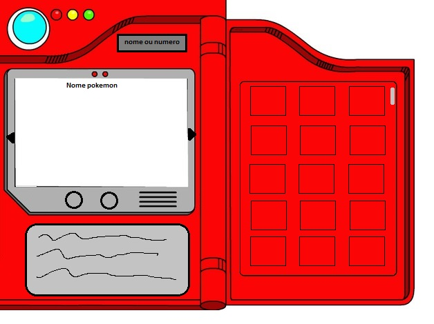

# Pokedex

# ideias

1    Exibir lista com os tipos de pokémons de acordo com sua numeração; 
    1.1  Ao selecionar o pokémon, ele irá fazer animação da pokedex e exibir o pokémon selecionado retornado pela API; 
2    Tela de status para o pokémon (Ataques e Atributos); 
3    Pokemon API = https://pokeapi.co/;

